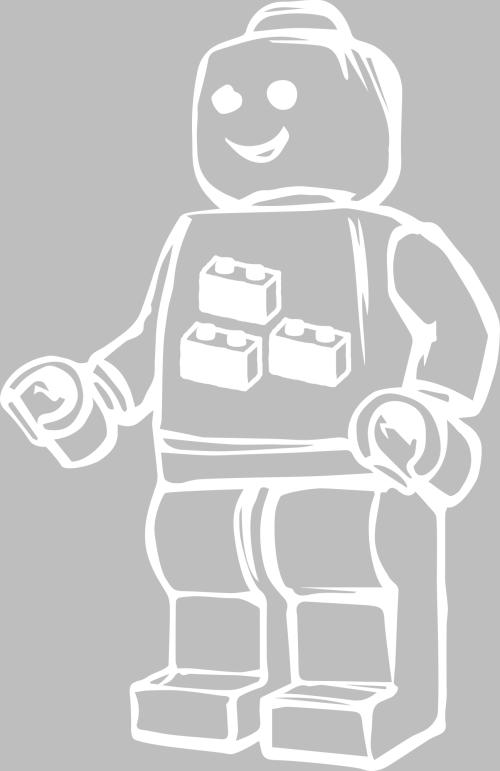
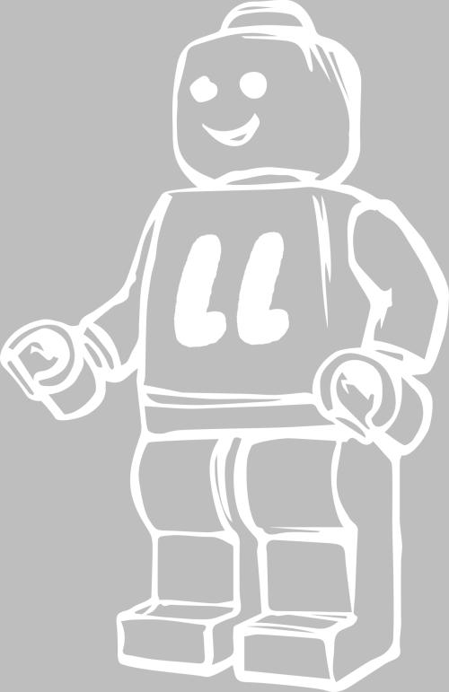
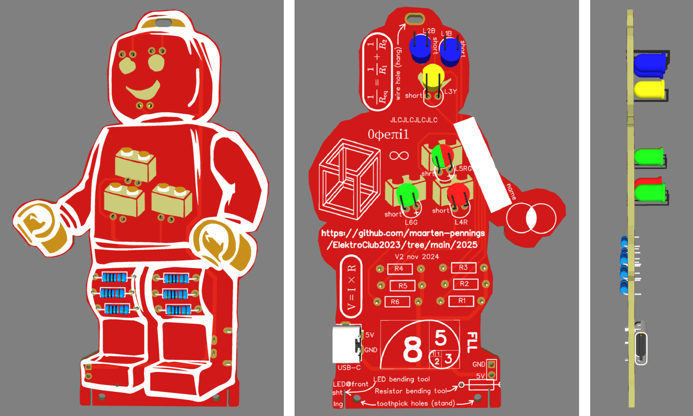
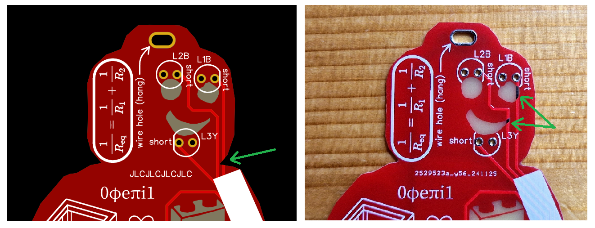
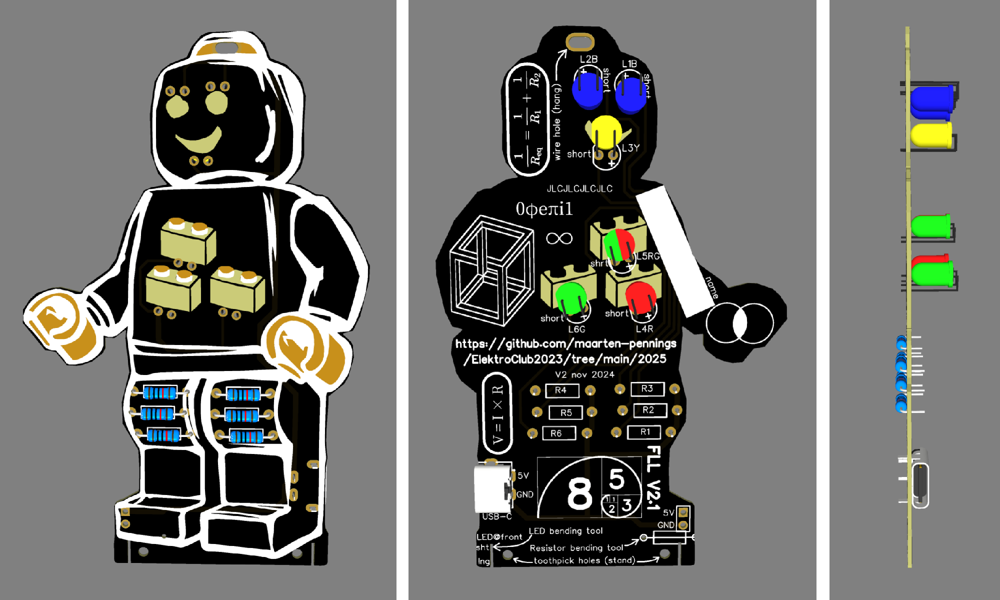
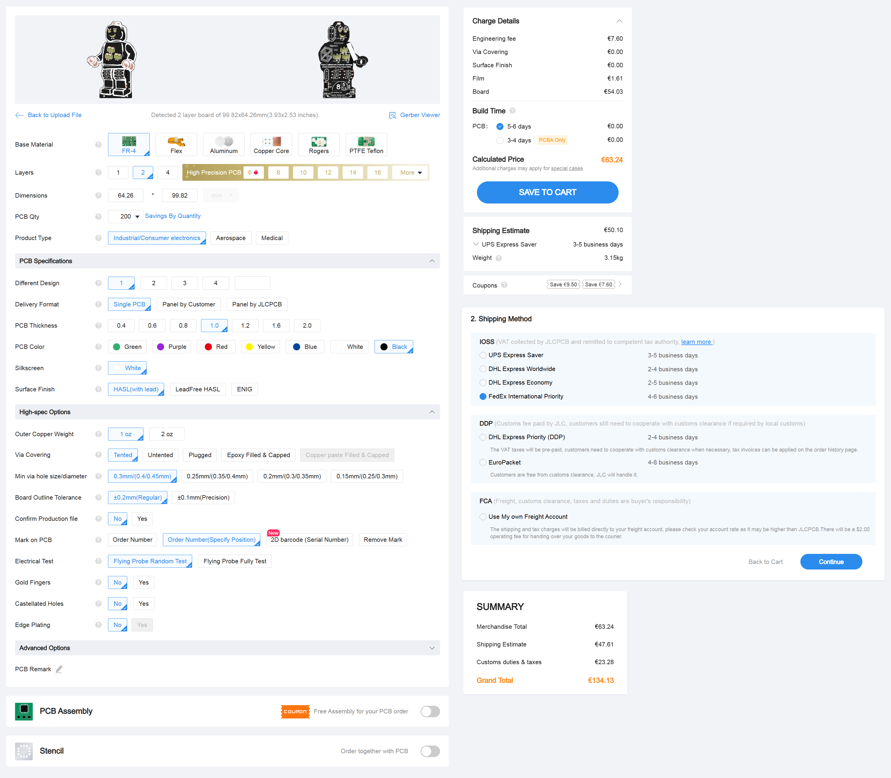
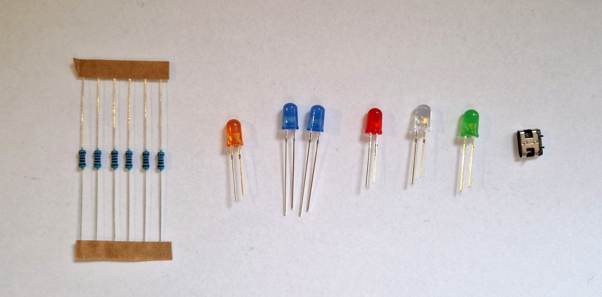

# Regio finale Limburg 2025

Create a new _solder kit_ for a side-activity during the _First LEGO League_ (FLL) contests in regio Limburg.

## Introduction

In 2023, I made the "LEGO man soldering kit" for De Kempel.
Soldering the kit is a side activity during the First LEGO League (FLL) regional finals 
(I guess region Noord Brabant - East).

We got contacted by the project lead of the [FLL for REGIO finale Limburg](https://www.steamlimburg.nl/) 
to make a similar soldering kit. They asked and got permission to reuse the design made 
for De Kempel, while also replacing the Kempel's logo.

## Concept

Two concepts were generated, one replacing the logo with 3 bricks, 
and one replacing the logo with two L's (Limburg LEGO).
The former was selected.

 

Some decisions:
- eyes blinking blue;
- mouth permanent yellow (orange);
- logo permanent red and permanent green and blinking red/green in the middle;
- switch from micro B to USB-C [connector](USBC-2Pin-Horizontal-Female__LCSC-C2919656.png);
- make all LEDs bend the same way (easier for the students).

## Design

First step is to make the schematics. I did that in [EasyEda](https://easyeda.com/), 
a Chinese in-browser design tool. The [easyeda source](ElektroClub2025FLL_V2_schem.json) 
as well as the [pdf](ElektroClub2025FLL_V2_schem.pdf) are in this repository.

Next step is to make a pcb layout. Also done with EasyEDA.
I used the artistic drawings `brick*.png` derived from the gimp source [brick.xcf](brick.xcf).
The [easyeda source](ElektroClub2025FLL_V2_pcb.json) 
as well as the [pdf](ElektroClub2025FLL_V2_pcb.pdf) are in this repository.

In the end, the [gerber](ElektroClub2025FLL_V2_gerber.zip) is used for PCB manufacturing.

## PCB manufacturing trial run (5 pieces)

I sent the gerber to [jlcpcb](https://jlcpcb.com/).
I did a trial run
- of 5 pieces (FR-4, 2 layers)
- thinner than normal (not 1.6 but 1.0 mm to save on shipping later when ordering 200 boards)
- red PCB with white silk screen
- JLCJLCJLCJLC marks where JlcPcb should put the order number

See [jlcpcb trial run 5 pieces](jlcpcb5.png) of my order (€ 11.34).

When I got the PCBs back I found some flaws
- The +/- annotation for the power supply pin header was flipped
- Red is _not_ a good solder mask color; it leaks to much light.
- There was copper in the eye/mouth diffuser 

The latter really surprised me, because I was sure I hand checked that before sending to JLCPCB.

The render on the left I what I sent. The photo on the right is what I got.
What happened?
My gut feeling is that JLCPCB saw I made and error. 
There is a copper track (light red) outside the board outline: I annotated that with a green arrow (left render).
JLCPCB corrected the error (without asking) by pushing the track inside - and for that
they had to push the next track also inside. 
Result: working board, but copper in mouth and eye.
It is great to know that JLCPCB reviews your design - but I would prefer if the ask what to do (and at least inform me).

## PCB manufacturing main run (200 pieces)

I fixed the errors.

The [resulting easyeda source](ElektroClub2025FLL_V2.1_schem.json) 
as well as the [pdf](ElektroClub2025FLL_V2.1_schem.pdf) are in this repository.

I send the [gerber](ElektroClub2025FLL_V2.1_gerber.zip) to JLCPCB and ordered 200 PCBs.

## Cost

Ordered the parts.

Next the trial run and the main run. 
This is the total cost.

|item| description                          | quantity |    price |                                                      link |
|:--:|:-------------------------------------|---------:|---------:|:---------------------------------------------------------:|
|  1 | LED blinking blue for eyes           |    2×200 |    13.35 |[🔗](https://www.aliexpress.com/item/1005003630965480.html)|
|  2 | LED permanent yellow mouth           |      200 |     4.28 |[🔗](https://www.aliexpress.com/item/1005006463058075.html)|
|  3 | LED permanent red logo               |      200 |     4.26 |[🔗](https://www.aliexpress.com/item/1005006463058075.html)|
|  4 | LED permanent green go               |      200 |     4.00 |[🔗](https://www.aliexpress.com/item/1005006463058075.html)|
|  5 | LED blinking red/green logo          |      200 |     5.68 |[🔗](https://www.aliexpress.com/item/1005006514757908.html)|
|  6 | Resistors 220 ohm                    |    6×200 |    15.36 |[🔗](https://www.aliexpress.com/item/1005002091320103.html)|
|  7 | USB connector female C               |      200 |    21.50 |[🔗](https://www.aliexpress.com/item/1005004403587119.html)|
|  8 | Zip-lock bags B-8×12 cm              |      200 |     5.16 |[🔗](https://www.aliexpress.com/item/1005005297741601.html)|
|  9 | Trial run 5 PCBs                     |        5 |    11.34 |[🔗](jlcpcb5.png)                                          |
| 10 | Main run 200 PCBs                    |      200 |   134.13 |[🔗](jlcpcb200.png)                                        |
|    |                                      |          |_________+|                                                           |
|    | Total cost (maps to €1.10 per kit)   |          |   219.06 |                                                           |

## Manual

There is a [manual](manual-v2.1.pdf) with soldering instructions ([source](manual-v2.1.docx)).

(end)
