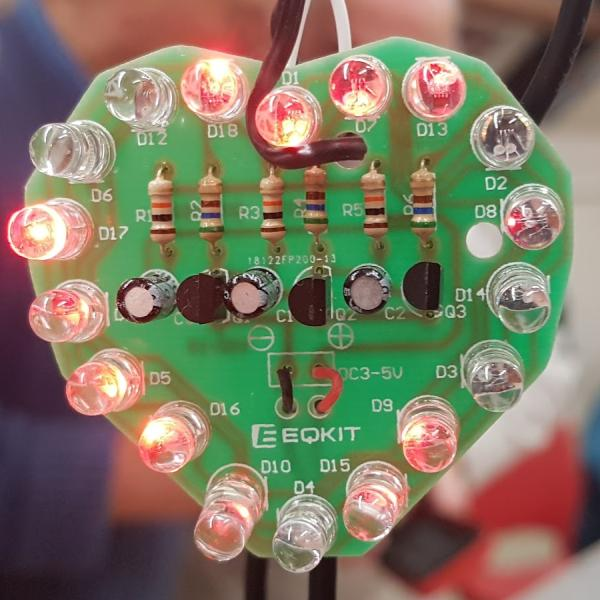
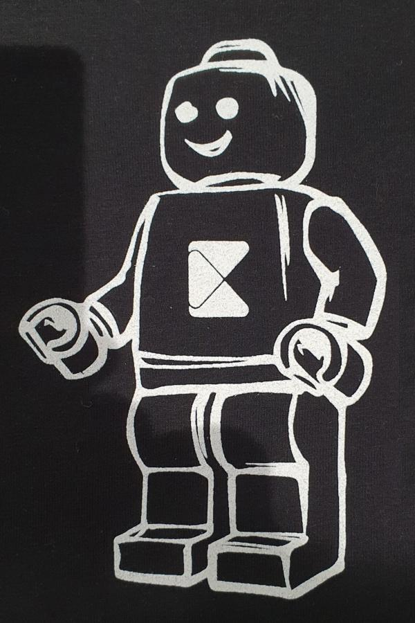
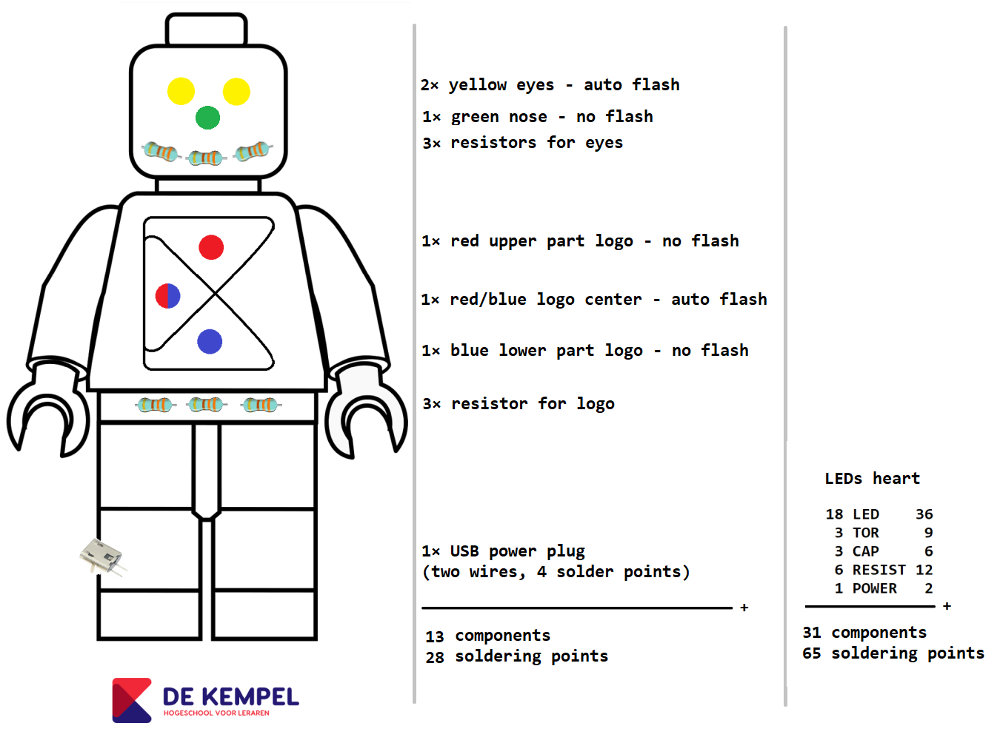
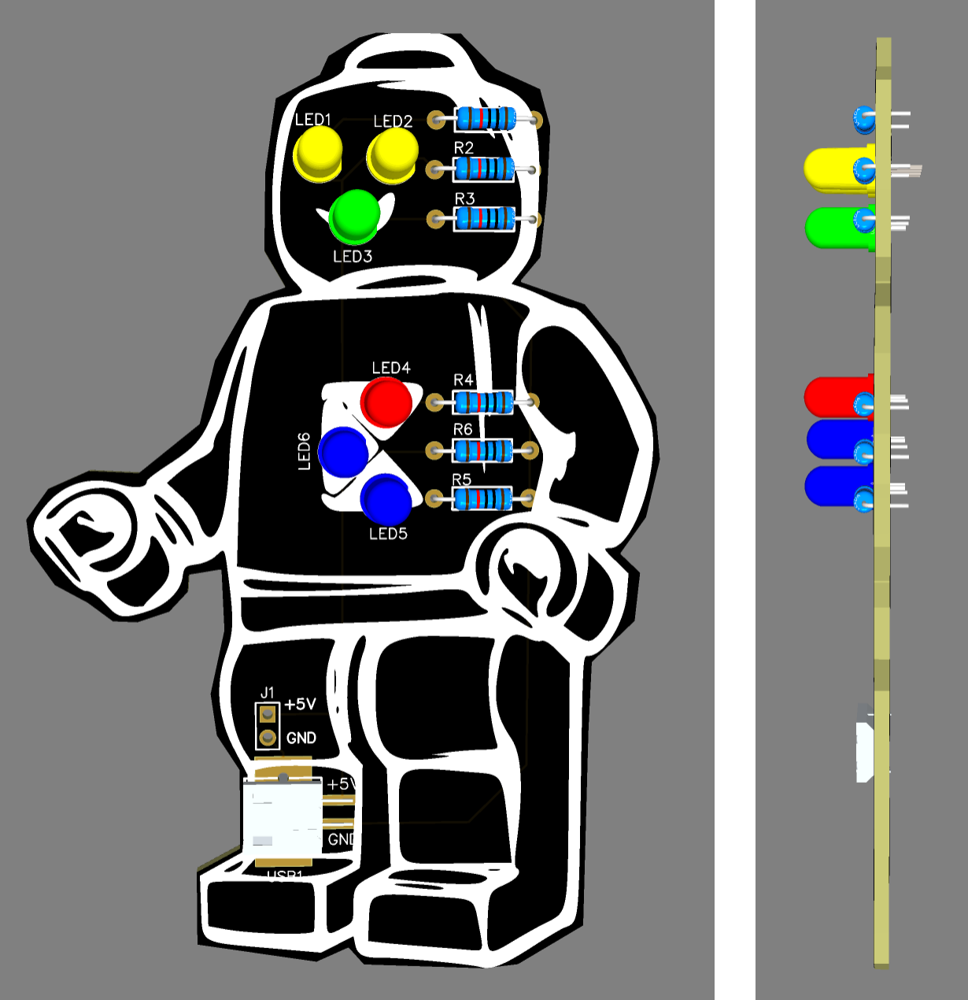

# ElektroClub2023

Create a new _solder kit_ for a side-activity during the _First LEGO League_ (FLL) contests organized by _De Kempel_.

## Introduction

Every year, Hogeschool De Kempel in Helmond organizes the First LEGO League (FLL) contests.
Many primary schools join the contests, but there are only two matches at one time, 
so many students are idling most of the day. Therefore De Kempel organizes side activities.

One of them is organized by the ElektroClub Waalre. We have a soldering kit that the students
can assemble. After assembling, we test them, and once found (made) working, the students can take them home.

We bought a large batch of kits resulting in a _LEDs heart_, 
much like [this one](https://www.aliexpress.com/item/1005005573776883.html).
After a couple of years, we are running out of these kits. We could buy new ones; 
they are very low cost, the link above sells 100 pieces for a discount (not 0,82 but 0.75 per piece)
and free shipping (not 18 euros), totaling to €74.25.

However, De Kempel wanted something more on-brand. Besides, the heart takes too much time; 
some students needed 3 hours, non could finish it in one hour.

## Concept
De Kempel suggested to use the contest logo.

We first had the idea to make a touch-on-touch-off system where the hands would be
the touch contacts. But such a schematic has too many different resistors, 
typically has different transistors, and has too many components.

Then the idea was born to simply use auto-flashing LEDs. They come in monochrome
and even dual or multi-color.

This more than halves the soldering points, and we no longer have 3-pin transistors.
Some complications remains: we still have polarity issues (LEDs) 
and we have components that look similar (LEDs of different color).

The concept was approved by the ElektroClub.
Next step is cost indication and approval from De Kempel.

## Cost estimation

Assumption was to order 100 kits.
The cost of just the **material** (components, PCB, packaging and documentation) is estimated at 150 euro.
See [cost](cost) for an breakdown of that estimation.

## Second concept

I made a more detailed concept (with real [gerber](ECFLL2023pcb.zip)).

Questions

 - Do we want to have the (green) nose, or is that overdone?
 - Do we want to have J1 (extra power facility for eg testing)?
 - Do we want the resistors and power plug at the back of the PCB for better looks? 
   If not other suggestion for location?
 - Do we want some labeling ("FLL De Kempen")? I guess no year.
 - I'm considering having the logo LEDs at the back, 
   and make the PCB transparent for the logo (remove copper) so that the light shines through.
   How about that idea?
 - I'm considering adding some texture, e.g. the hand being bare copper.
   How about that idea?

 
(end)
