# Cost

This pages gives and overview of the costs.
My first assumption was to make 100 kits, but lately this is shifting towards 150 kits.

## Items

|item| description                          | quantity |   price |                                                      link |
|:--:|:-------------------------------------|---------:|--------:|:---------------------------------------------------------:|
|  1a| LED flash white for eyes (clear)     | (200+) 0 |    9.16 |[🔗](https://www.aliexpress.com/item/1005003630965480.html)|
|  1b| LED flash yellow for eyes            |    2×150 |   10.81 |[🔗](https://www.aliexpress.com/item/1005003630965480.html)|
|  2 | LED no-flash green nose              | (50+)150 |    5.51 |[🔗](https://www.aliexpress.com/item/1005005071977501.html)|
|  3 | LED no-flash red logo                | (50+)150 |    5.37 |[🔗](https://www.aliexpress.com/item/1005005071977501.html)|
|  4 | LED no-flash blue logo               | (50+)150 |    5.49 |[🔗](https://www.aliexpress.com/item/1005005071977501.html)|
|  5 | LED flash red/blue logo              |      150 |    4.93 |[🔗](https://www.aliexpress.com/item/1005003797732300.html)|
|  6 | Resistors                            |    6×150 |    6.81 |[🔗](https://www.aliexpress.com/item/1005002091320103.html)|
|  7 | USB connector female micro B         |      150 |   11.67 |[🔗](https://www.aliexpress.com/item/1005003803598713.html)|
|  8 | Zip-lock backs 8×12 cm               | (50+)150 |    4.72 |[🔗](https://www.aliexpress.com/item/1005005297741601.html)|
|  9 | Assembly manual (A4 paper)           |      150 |(?)15.00 |                                                           |
| 10 | Trial run 1 PCB (2.00+7.00 shipping) |        5 |(?) 9.00 |                                                           |
| 11 | Trial run 2 PCB (2.00+7.00 shipping) |        5 |(?) 9.00 |                                                           |
| 12 | Main order PCB (40.00+40.00 shipping)|      150 |(?)97.56 |                                                           |
|    |                                      |          |________+|                                                           |
|    | Total cost (maps to €1.30 per kit)   |          |  195.03 |                                                           |

## Invoices

Due to long lead times (Ali Express), low-cost, and the need to know footprints
before ordering PCBs, I decided to already order some of the components.
Later I ordered the remaining, the third time I switched from 100 to 150 pieces.

### LED flash white for eyes (item 1a)

I forgot there are two eyes per kit so I ordered another 100.
Two times €4.58 is €9.16.

But then, I decided to switch to LEDs with yellow housing (instead of clear) 
so that the students do not confuse them with the clear red/blue one.
So these clear LEDs will not be used...

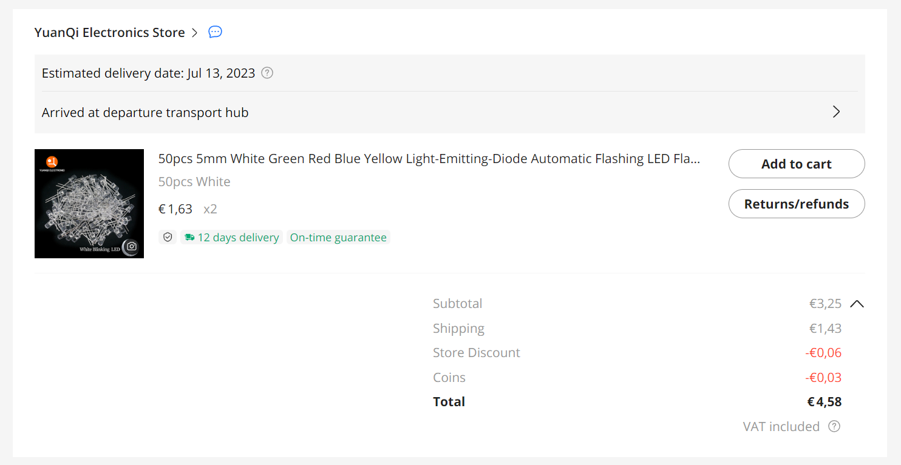

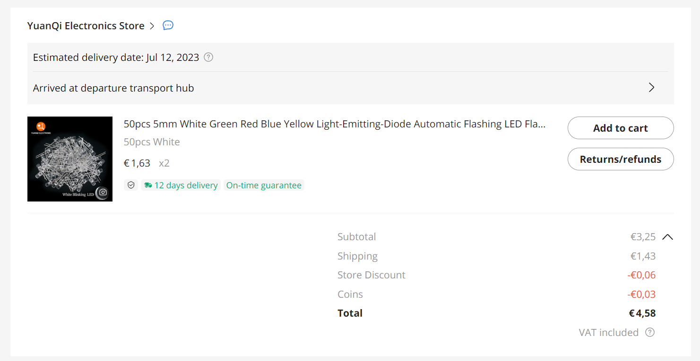

### LED flash yellow for eyes (item 1b)

I decided to switch to LEDs with yellow housing (instead of clear) so that the students do not confuse them with the clear red/blue one.
I also decided to aim at 150 kits, so 300 LEDs.

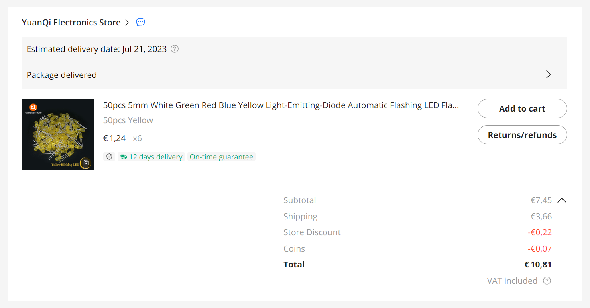

### LED no-flash logo and nose (item 2, 3, 4)

I divided shipping and discount (€5.00 - €0.04) over 3 items, that is €1.65 each.

Then green is €1.14 + €1.65 = €2.79, red is €1.07 + €1.65 = €2.72, 
and blue is €8.29 - €2.70 - €2.72 = €2.78.

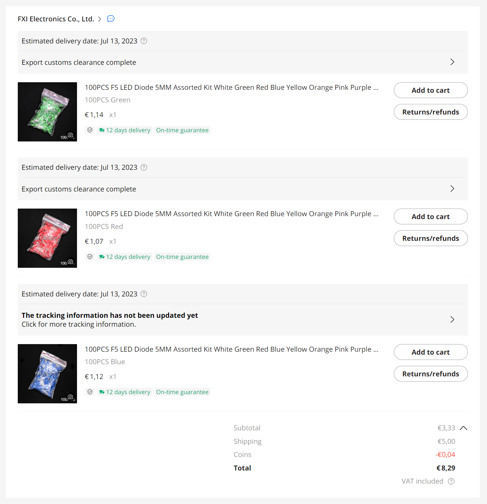

Upgraded to 150 items. They got cheaper.
I divided shipping and discount (€4.87 - €0.04) over 3 items, that is €1.61 each.
Then green is €1.11 + €1.61 = €2.72, red is €1.04 + €1.61 = €2.65, 
and blue is €8.08 - €2.72 - €2.65 = €2.71.

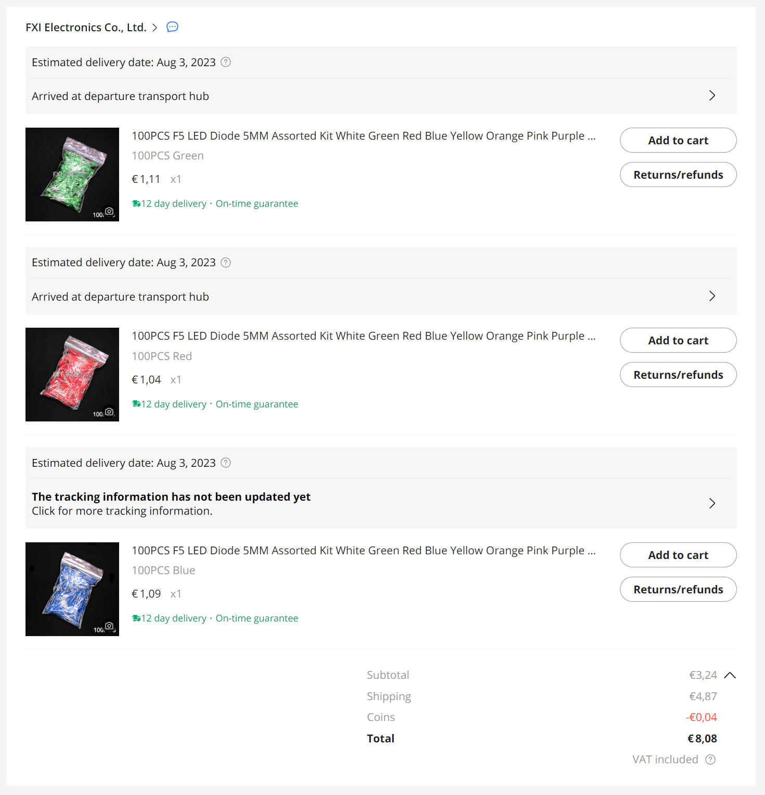

With that, green is €2.79+€2.72=€5.51, red is €2.72+€2.65=€5.37, and blue is €2.78+€2.71=€5.49.

### LED flash red/blue logo (item 5)

With shipping and discount €4.93.

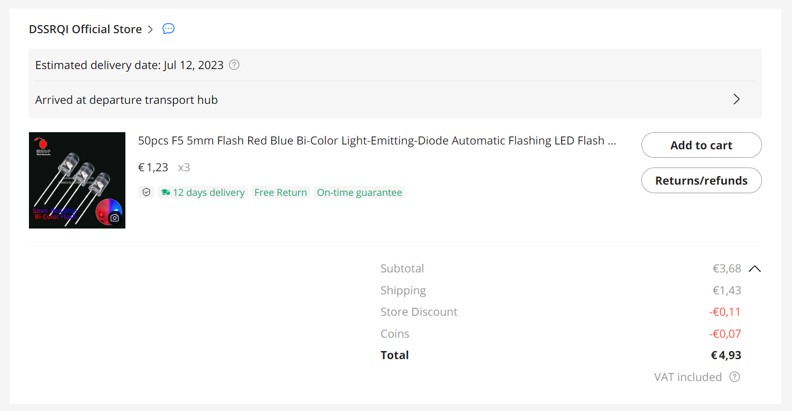

### Resistors (item 6)

We have 6 LEDs per kit, so we need 600 resistors. I ordered 100 spare: €4.74.

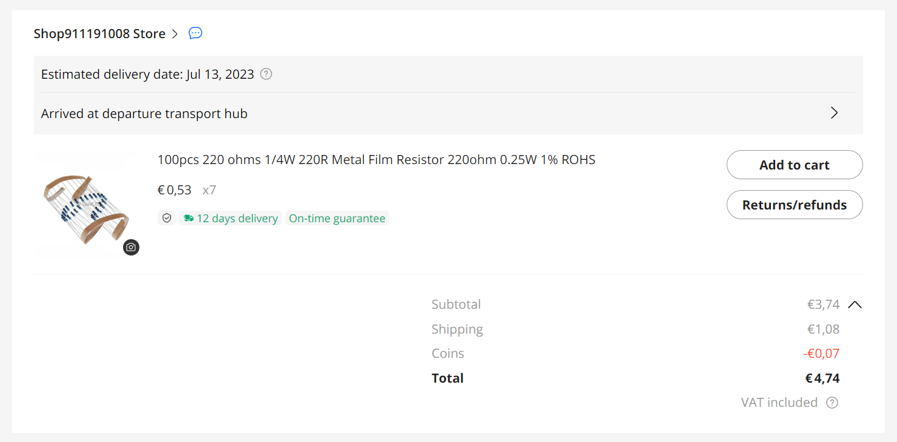

Upgraded to 150 items; that means 6×150=900, we had 700 so I ordered another 200 for €2.07, bringing the total to €6.81.

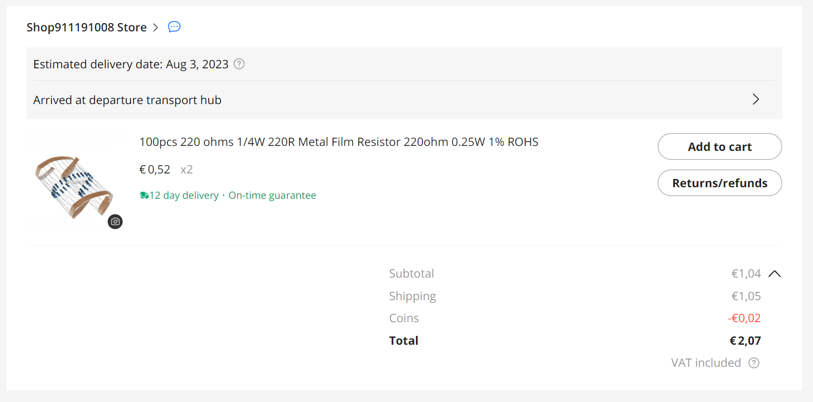

### Power supply (item 7)

One of the harder decisions is the kind of power supply.

I found four options, prices below are for 100 kits.

 - 7a. dual AAA battery box with batteries - €68.10
 - 7b. 30cm USB cable met standard male A - €58.76
 - 7c. USB connector female C - €6.70
 - 7d. USB connector female micro B  - €6.75

When I ordered the USB micro B prices had gone up to €7.22.
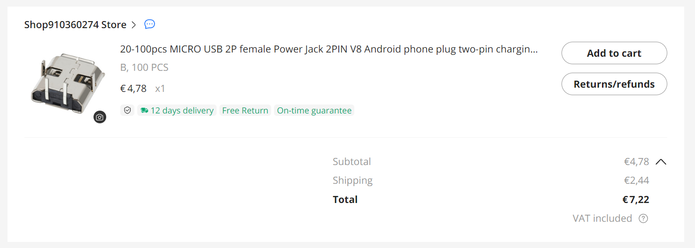

The upgrade to 150 added 4.45 to 7.22 totaling €11.67.
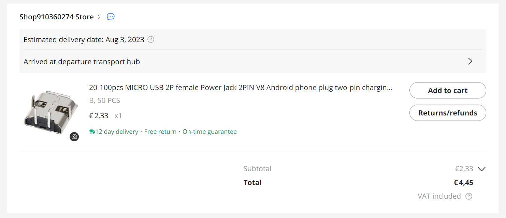

### Zip-lock backs (item 8)

Zip-lock bags, big enough for PCB, which is estimated at 100×60mm². Cost €4.72.

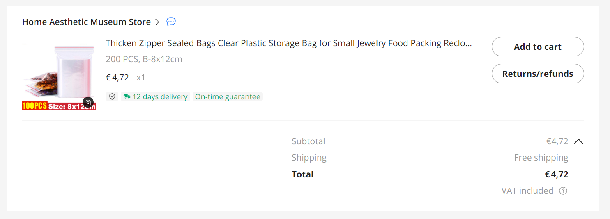

### Assembly manual (item 9)

Assumption: 150 times 1 page A4 a 10 cent, makes €15.00.

### PCBs (item 10, 11, 12)

First order 5 PCBs to see if all is ok. And maybe a second round.

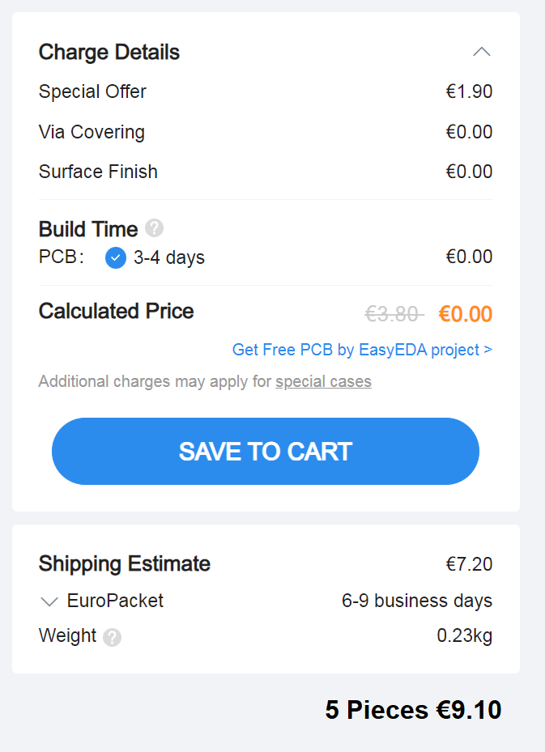

When trial runs are ok, order 100 pieces

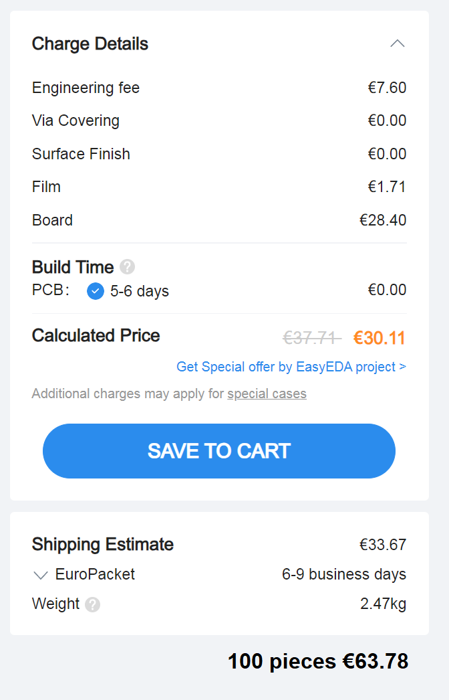

PCB cost per board

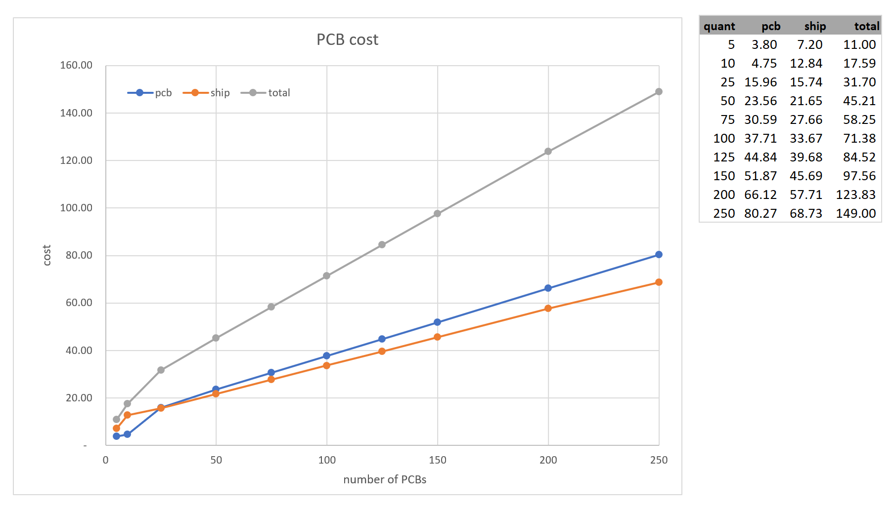

(end)
 