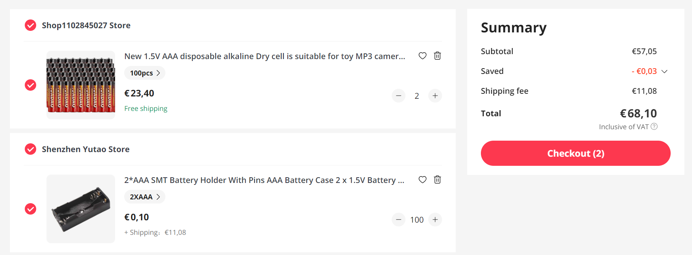
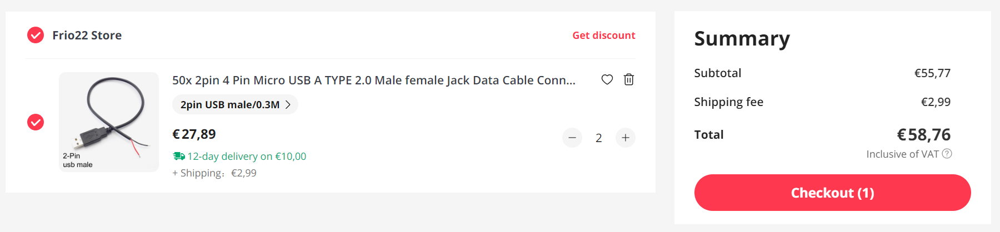
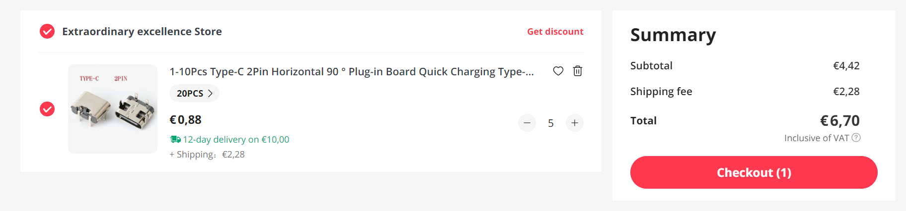
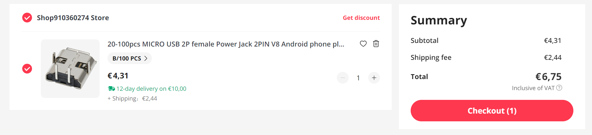

# Cost

This pages gives and overview of the costs

## Items

| id | description                          | quantity |estimate|   price |                                                      link |
|:--:|:-------------------------------------|---------:|-------:|--------:|:---------------------------------------------------------:|
|  1a| LED flash white for eyes (clear)     |      200 |        |    9.16 |[🔗](https://www.aliexpress.com/item/1005003630965480.html)|
|  1b| LED flash white for eyes (yellow)    |      200 |   7.08 |(?) 7.08 |[🔗](https://www.aliexpress.com/item/1005003630965480.html)|
|  2 | LED no-flash green nose              |      100 |        |    2.79 |[🔗](https://www.aliexpress.com/item/1005005071977501.html)|
|  3 | LED no-flash red logo                |      100 |        |    2.72 |[🔗](https://www.aliexpress.com/item/1005005071977501.html)|
|  4 | LED no-flash blue logo               |      100 |        |    2.78 |[🔗](https://www.aliexpress.com/item/1005005071977501.html)|
|  5 | LED flash red/blue logo              |      100 |        |    4.93 |[🔗](https://www.aliexpress.com/item/1005003797732300.html)|
|  6 | Resistors                            |(100+)600 |        |    4.74 |[🔗](https://www.aliexpress.com/item/1005002091320103.html)|
|====| Power options - not yet ordered      |==========|========|=========|====                                                       |
| 7a | dual AAA battery box with batteries  |      100 |  68.10 |         |[🔗](https://www.aliexpress.com/item/1005005052171962.html) [🔗](https://www.aliexpress.com/item/1005005681807680.html)|
| 7b | 30cm USB cable met standard male A   |      100 |  58.76 |         |[🔗](https://www.aliexpress.com/item/1005001728575384.html)|
| 7c | USB connector female C               |      100 |   6.70 |         |[🔗](https://www.aliexpress.com/item/1005004403587119.html)|
| 7d | USB connector female micro B         |      100 |   6.75 |(?) 6.75 |[🔗](https://www.aliexpress.com/item/1005003803598713.html)|
|====| PCB - not yet ordered                |==========|========|=========|====                                                       |
|  8 | trial run PCB (2.00+7.00 shipping)   |        5 |   9.00 |(?) 9.00 |
|  9 | main order PCB (40.00+40.00 shipping)|      100 |  80.00 |(?)80.00 |    
|====| Miscellaneous - not yet ordered      |==========|========|=========|====                                                       |
| 10 | Assembly manual (A4 paper)           |      100 |  10.00 |(?)10.00 |
| 11 | zip lock backs 8×12 cm               |      100 |  10.00 |(?)10.00 |[🔗](https://www.aliexpress.com/item/1005005297741601.html)|
|    |                                      |          |        |________+|
|    |                                      |          |        |  149.95 |

## Invoices

Due to long lead times (Ali Express), low-cost, and the need to know footprints
before ordering PCBs, I decided to already order some of the components.

### LED flash white for eyes (id 1)

I forgot there are two eyes per kit so I ordered another 100.
Two times €4.58 is €9.16.

I'm considering buying ones with yellow housing (instead of clear) so that the students do not confuse them with the clear red/blue one.

### LED no-flash logo and nose (id 2, 3, 4)

I divided shipping and discount (€5.00 - €0.04) over 3 items, that is €1.65 each.

Then green is €1.14 + €1.65 = €2.79, red is €1.07 + €1.65 = €2.72, 
and blue is €8.29 - €2.70 - €2.72 = €2.78.

### LED flash red/blue logo (id 5)

With shipping and discount €4.93.

### Resistors (id 6)

We have 6 LEDs per kit, so we need 600 resistors. I ordered 100 spare: €4.74.

### Power supply (id 7)

One of the harder decisions is the kind of power supply.

I found four options, prices below are for 100 kits.

 7a. dual AAA battery box with batteries - €68.10
 7b. 30cm USB cable met standard male A - €58.76
 7c. USB connector female C - €6.70
 7d. USB connector female micro B  - €6.75

### Trial PCB (8)

First order 5 PCBs to see if all is ok.

### Main order PCB (9)

When trial run is ok, order 100 pieces

### PCB cost per board

(end)
 