# Cost

This pages gives and overview of the costs.
My first assumption was to make 100 kits, later 150 and finally this shifted to 200 kits.

## Items

|item| description                          | quantity |    price |                                                      link |
|:--:|:-------------------------------------|---------:|---------:|:---------------------------------------------------------:|
|  1a| LED flash white for eyes (clear)     | (200+) 0 |     9.16 |[🔗](https://www.aliexpress.com/item/1005003630965480.html)|
|  1b| LED flash yellow for eyes            |    2×200 |    16.83 |[🔗](https://www.aliexpress.com/item/1005003630965480.html)|
|  2 | LED no-flash green nose              |      200 |     5.51 |[🔗](https://www.aliexpress.com/item/1005005071977501.html)|
|  3 | LED no-flash red logo                |      200 |     5.37 |[🔗](https://www.aliexpress.com/item/1005005071977501.html)|
|  4 | LED no-flash blue logo               |      200 |     5.49 |[🔗](https://www.aliexpress.com/item/1005005071977501.html)|
|  5 | LED flash red/blue logo              |      200 |     7.30 |[🔗](https://www.aliexpress.com/item/1005003797732300.html)|
|  6 | Resistors                            |    6×200 |     9.56 |[🔗](https://www.aliexpress.com/item/1005002091320103.html)|
|  7 | USB connector female micro B         |      200 |    16.26 |[🔗](https://www.aliexpress.com/item/1005003803598713.html)|
|  8 | Zip-lock backs 8×12 cm               |      200 |     4.72 |[🔗](https://www.aliexpress.com/item/1005005297741601.html)|
|  9 | Trial run 1 PCB                      |       10 |     7.17 |                                                           |
| 10 | Trial run 2 PCB                      |       10 |     7.43 |                                                           |
| 11 | Main order PCB                       |      200 |   107.86 |                                                           |
|    |                                      |          |_________+|                                                           |
|    | Total cost (maps to €1.01 per kit)   |          |   202.66 |                                                           |

## Invoices

Due to long lead times (Ali Express), low-cost, and the need to know footprints
before ordering PCBs, I decided to already order some of the components.
Later I ordered the remaining, the third time I switched from 100 to 150 pieces.
The fourth order upgraded to 200 pieces.

### LED flash white for eyes (item 1a) - NOT USED

I forgot there are two eyes per kit so I ordered another 100.

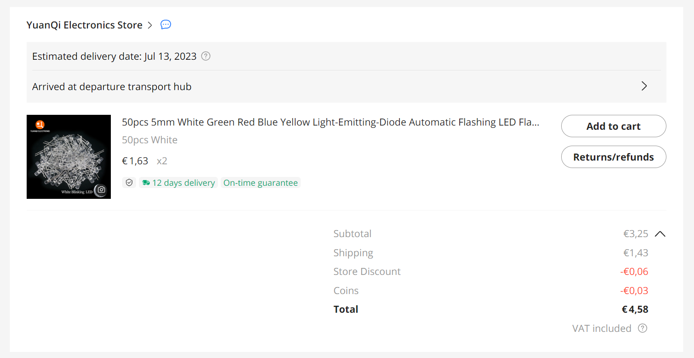

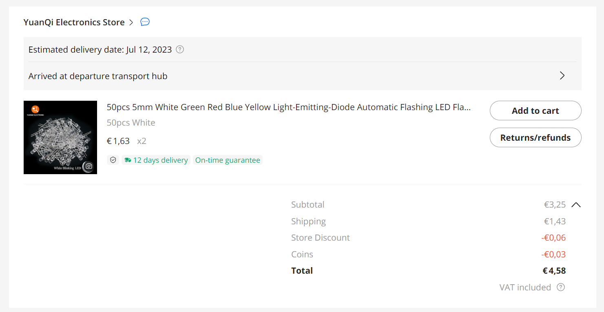

But then, I decided to switch to LEDs with yellow housing (instead of clear) 
so that the students do not confuse them with the clear red/blue one.
So these clear LEDs will not be used...

Two times €4.58 is €9.16 (200 yellow flashing, white house, not used).

### LED flash yellow for eyes (item 1b)

I decided to switch to LEDs with yellow housing (instead of clear) so that the students do not confuse them with the clear red/blue one.
I also decided to aim at 150 kits, so 300 LEDs.

I upgraded to 200 kits, so an extra 100 LEDs.

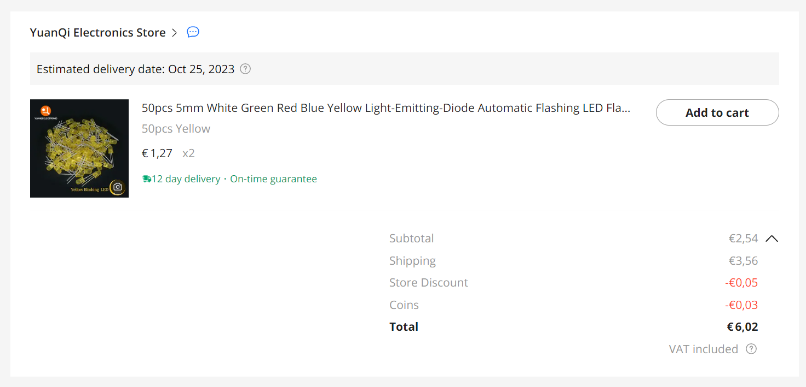

With that, 2×200 yellow LED is €10.81+€6.02=€16.83.

### LED no-flash logo and nose (item 2, 3, 4)

I divided shipping and discount (€5.00 - €0.04) over 3 items, that is €1.65 each.

Then green is €1.14 + €1.65 = €2.79, red is €1.07 + €1.65 = €2.72, 
and blue is €8.29 - €2.70 - €2.72 = €2.78.

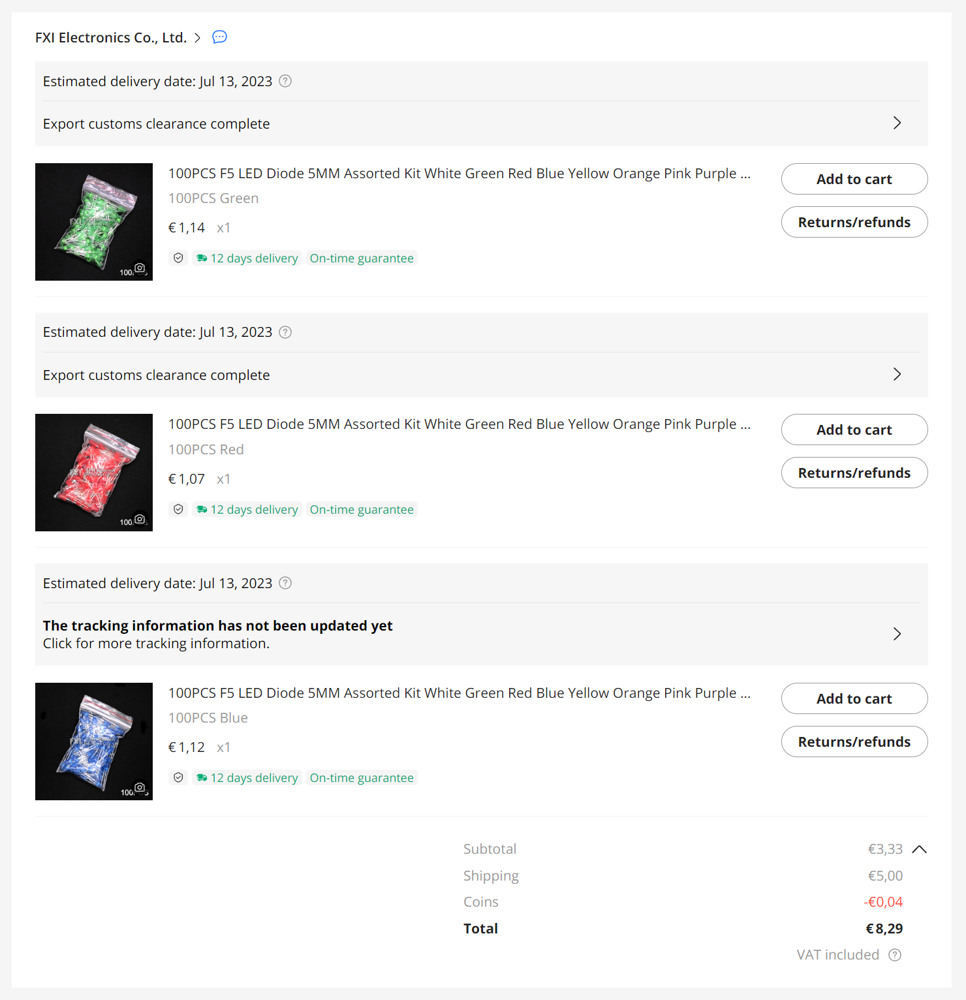

Upgraded to 150 items (actually 200). They got cheaper.
I divided shipping and discount (€4.87 - €0.04) over 3 items, that is €1.61 each.
Then green is €1.11 + €1.61 = €2.72, red is €1.04 + €1.61 = €2.65, 
and blue is €8.08 - €2.72 - €2.65 = €2.71.

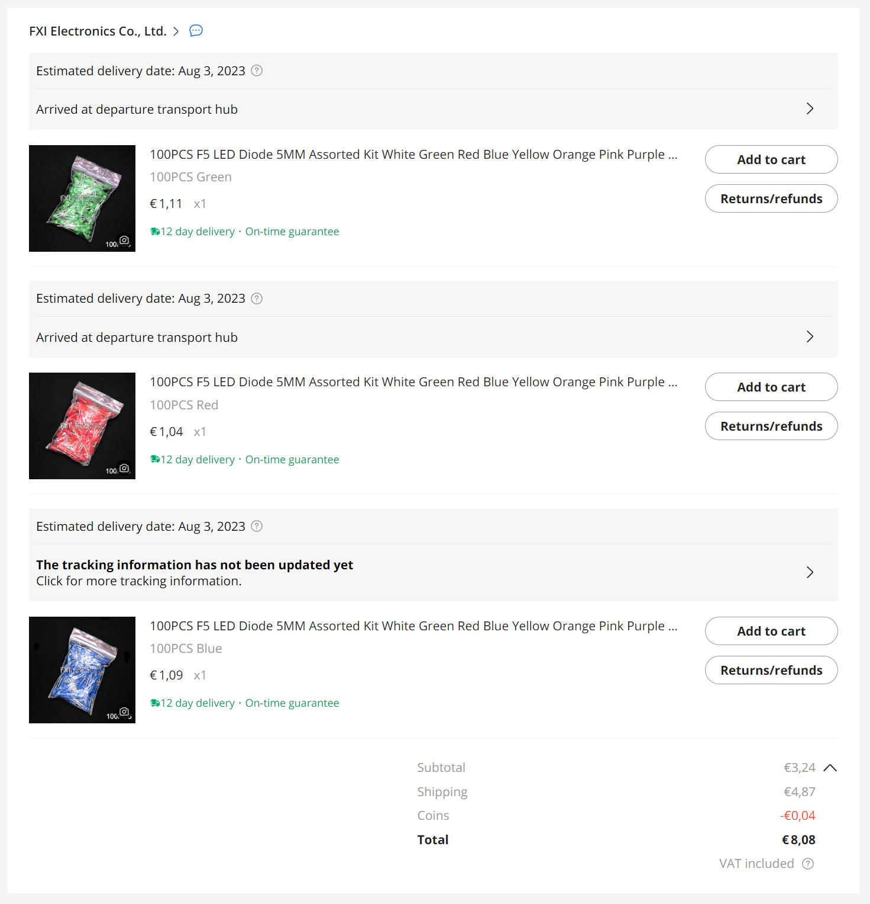

With that, item (2) 200 green is €2.79+€2.72=€5.51.

Item (3) 200 red is €2.72+€2.65=€5.37.

Item(4) 200 blue is €2.78+€2.71=€5.49.

### LED flash red/blue logo (item 5)

With shipping and discount €4.93.

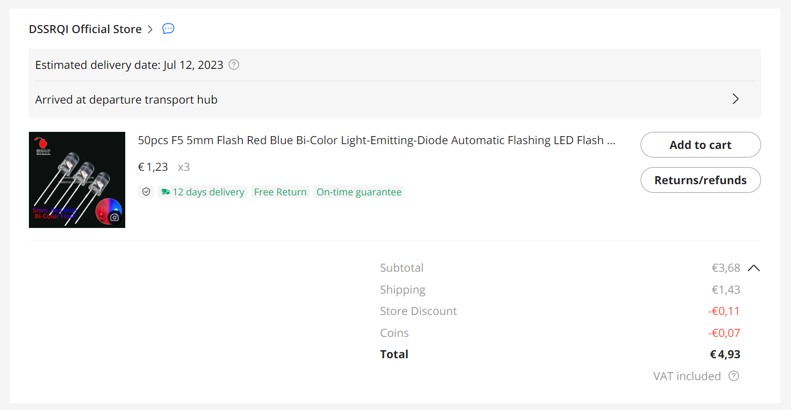

I upgraded to 200 kits, so an extra 50 LEDs.

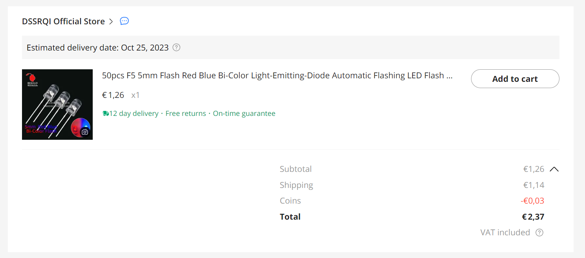

With that, 200 red/blue (transparant case) LED is €4.93+€2.37=€7.30.

### Resistors (item 6)

We have 6 LEDs per kit, so we need 600 resistors. I ordered 100 spare: €4.74.

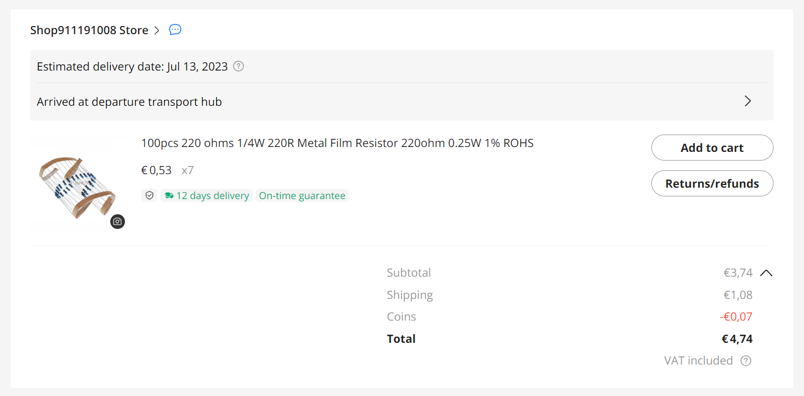

Upgraded to 150 items; that means 6×150=900, we had 700 so I ordered another 200 for €2.07.

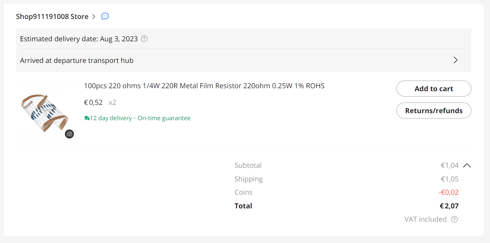

I upgraded to 200 kits, so an extra 300 resistors.

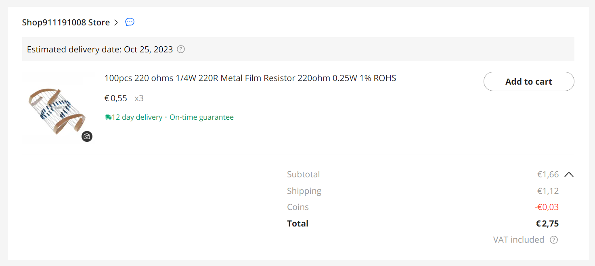

With that, 6×200 resistors is €4.74+€2.07+€2.75=€9.56.

### Power supply (item 7)

One of the harder decisions is the kind of power supply.

I found four options, prices below are for 100 kits.

 - 7a. dual AAA battery box with batteries - €68.10
 - 7b. 30cm USB cable met standard male A - €58.76
 - 7c. USB connector female C - €6.70
 - 7d. USB connector female micro B  - €6.75

When I ordered the USB micro B prices had gone up to €7.22.
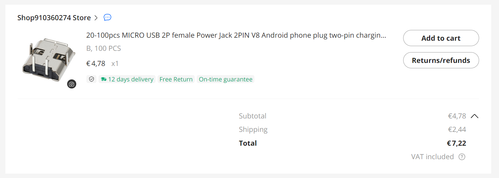

The upgrade to 150 added 4.45 to 7.22 totaling €11.67.
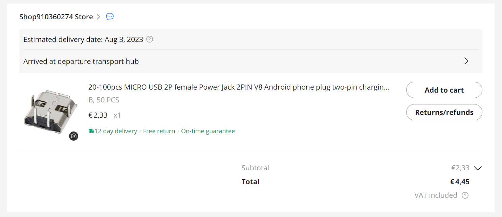

I upgraded to 200 kits, so an extra 50 connectors.

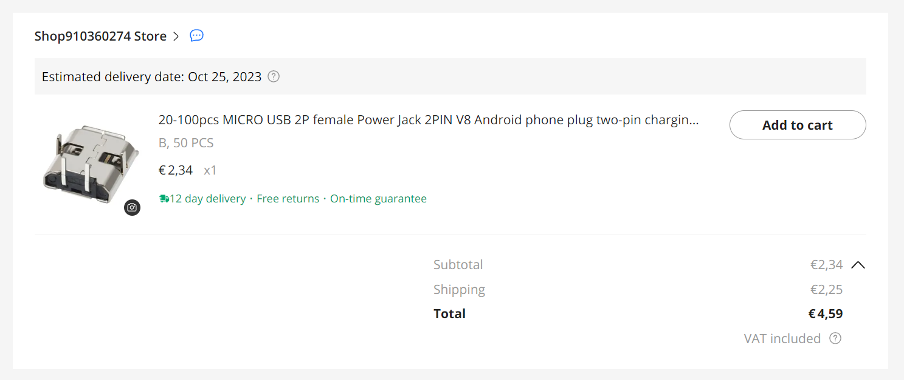

With that, 200 connectors is €7.22+€4.45+€4.59=€16.26.

### Zip-lock backs (item 8)

Zip-lock bags, big enough for PCB, which is estimated at 100×60mm². 

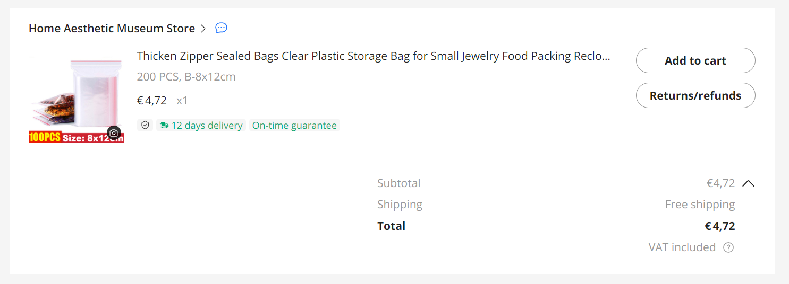

Cost for 200 bags €4.72.

### Trial run 1 PCB (item 9)

PCB cost per board is rather linear.

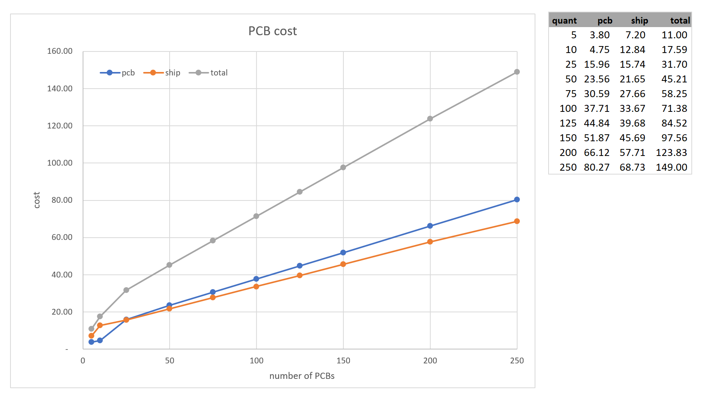

First test run is small quantity.

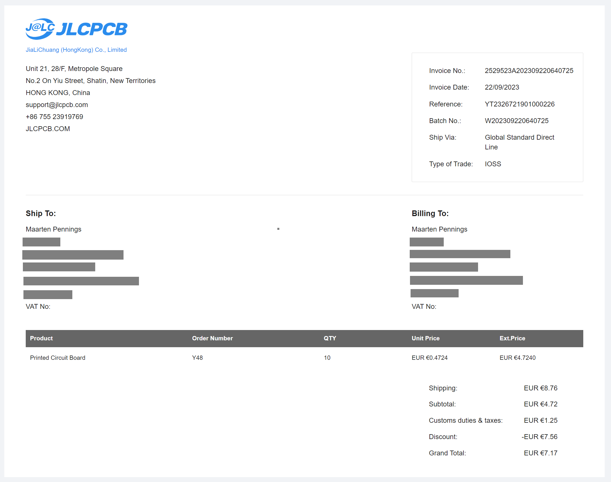

Cost for trial run 1 (10 PCBs) is €7.17.

### Trial run 2 PCB (item 10)

Second test run is also a small quantity.

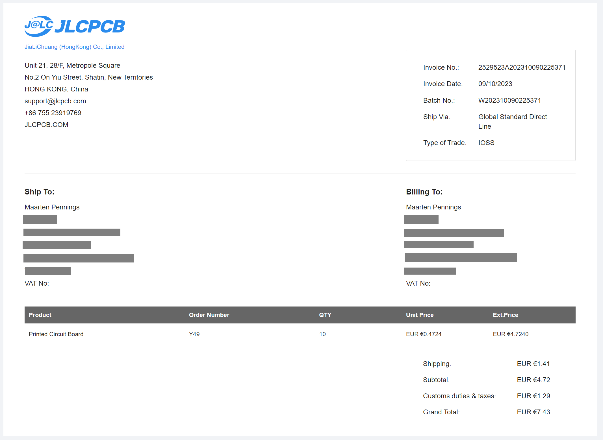

Cost for rial run 2 (10 PCBs) is €7.43.

### PCBs (item 11)

Finally we ordered the 200 boards.
We picked 1.0mm thick instead of 1.6mm and that saved quite a lot in shipping.

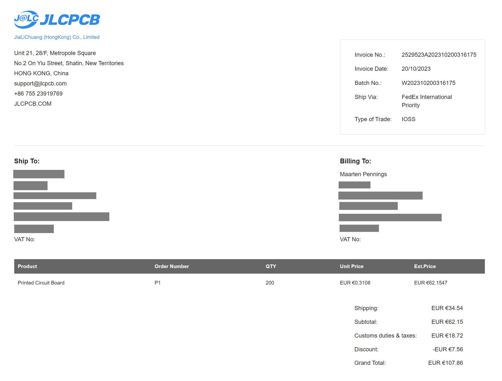

Cost for main order (200 PCBs) is €107.86.

(end)
 
